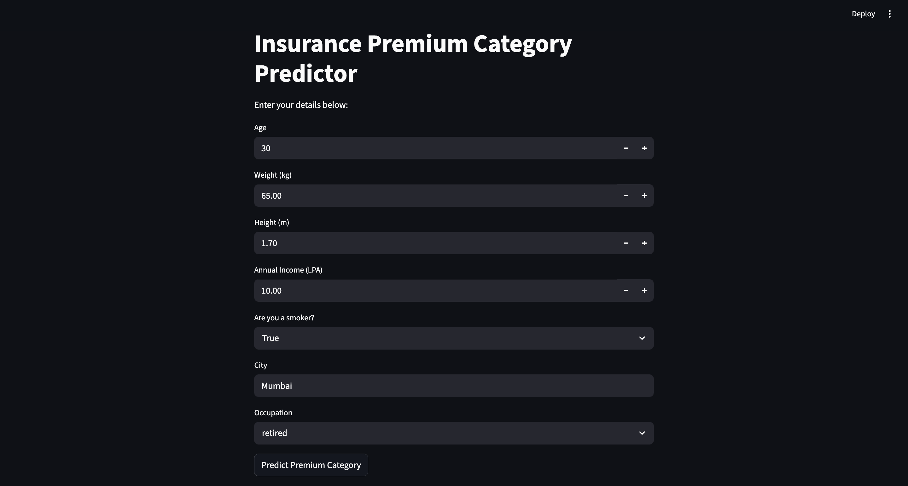
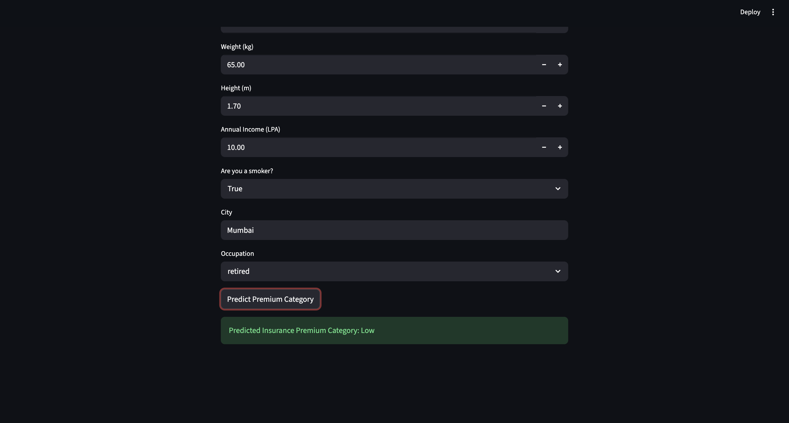

# AI Insurance Premium Predictor

A full-stack machine learning application that predicts insurance premium categories based on user data using a trained Random Forest model.

---

## Features

* Machine Learning model with feature engineering
* FastAPI backend for predictions
* Streamlit frontend UI
* Real-time prediction system
* Clean and modular project structure

---

## Tech Stack

* Python
* Scikit-learn
* FastAPI
* Streamlit
* Pandas
* NumPy

---

## Input Features

* Age
* Weight
* Height
* Income (LPA)
* Smoker status
* City
* Occupation

---

## Output

* Insurance Premium Category:

  * Low
  * Medium
  * High

---

## Screenshots

### 🔹 User Interface



### 🔹 Prediction Result



---

## How to Run Locally

### 1. Clone the repository

```bash
git clone https://github.com/your-username/Insurance-Premium-Prediction-ML.git
cd Insurance-Premium-Prediction-ML
```

---

### 2. Install dependencies

```bash
pip install -r requirements.txt
```

---

### 3. Run FastAPI backend

```bash
uvicorn backend.app:app --reload
```

---

### 4. Run Streamlit frontend

```bash
streamlit run frontend/frontend.py
```

---

## Future Improvements

* Improve UI/UX design
* Add confidence scores in prediction
* Deploy on cloud (Render / AWS / Vercel)
* Add user authentication

---

## Author

Mitali Awasthi
